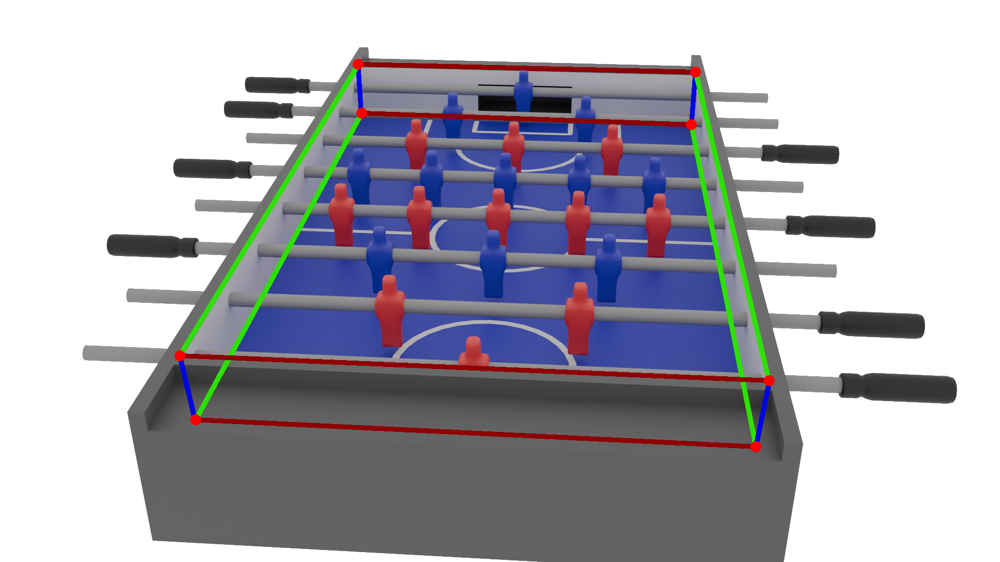

# Foosball in Perspective Detection

A computer vision system that maps positions from images to real-world coordinates on foosball tables under perspective distortion.



---

## Table of Contents
- Project Overview
- Repository Structure
- Dataset
- Qualitative Analysis 
- Docker & Running the Application
- API Documentation

---

## Project Overview

If we want to make a robot able to play foosball, we will certainly need a vision system capable
of detecting at least the position of the ball (𝑥, 𝑦) on the table.

Let us consider a camera-based setup: how can we convert a position from image coordinates (𝑟, 𝑐)
to table coordinates (𝑥, 𝑦) ?

In an ideal scenario, where we have a fixed top-down camera with some zoom to reduce perspective, and the foosball table aligned with the image edges, the translation is easy.

But what if:
- The camera is not fixed, or the table moves throughout the match ?
- The camera has no zoom and does not capture the table from above ?

The project goal is to implement a system that allows to translate positions from image coordinates (𝑟, 𝑐) to table coordinates (𝑥, 𝑦) in these non-ideal scenarios.

To do this, the project is divided into two main parts:
- An AI vision model to detect the vertices of the table as keypoints.
- A translation algorithm to translate positions using those vertices.

---

## Repository Structure

```text
├── app
│   ├── algorithms     # Algorithms used by the APIs
│   ├── model          # The best.pt model
│   ├── static         # Images, .js scripts and .css styles
│   ├── templates      # .html files
│   ├── uploads        # Where, temporarily the uploads of the user will be saved
│   └── app.py         
│
├── data               # The default/first dataset
├── added-data         # Data added to the default/first dataset
├── augmented-data     # The augmented and final dataset
│
├── notebooks          # Jupyter notebooks for data and clusters analysis
├── results
│   ├── clustering     # K-Means results saved as .json files
│   ├── dataframes     # Pandas dataframes saves as .parquet
│   └── images         # Various graphs and cluster samples
│
├── src
│   ├── clustering.py                     # Divides in clusters and save the results
│   ├── clustering_data_augmentation.py   # Data Augmentation guided by the clusters
│   ├── config.py                         # Contains path and other constants
│   ├── dataframes_data_augmentation.py   # Data Augmentation guided by the dataframes
│   ├── dataframes_preparation.py         # Calculates and saves the dataframes as .parquet
│   ├── divide_data_sets.py               # Divide the dataset into train, val and test
│   ├── features_extraction.py            # Extract features from the images of a dataset
│   ├── image_processing.py               # Image processing for features_extraction.py
│   ├── utility.py                        # Utility functions
│   ├── yolo_training.py                  # YOLO training
│   └── yolo_validation.py                # YOLO validation
│               
└── yolo
    ├── data-sets-division  # Contains train.txt, val.txt and test.txt for YOLO
    └── runs                # The runs for the YOLO training
```
---

## Dataset

This sections should help you understand for what scenarios this project is aimed about.

The dataset (before data augmentation) is composed of 1128 images extracted as individual frames from online videos (e.g., YouTube).

The images exhibit a wide variability in camera angles, table models, acquisition environments, camera devices and zoom levels, as well as lighting conditions.

All images are taken from a spectator view, which refers to the perspective you would have when observing the match from the short side of the table, while other players occupy the long sides.

Examples of spectator view:


For the keypoints order in the annotation we have the following rules:
- Considering the upper rectangle, the highest vertice is the keypoint 0 if, going clockwise, the next vertice is on the short side of the table, and keypoint 1 otherwise.
- The rest of the vertices follow the clockwise order.
- For the lower rectangle we add 4 to every previous keypoint.

Example:


**Note:** in every image of the dataset, the first four keypoints are always present, even if occluded by an obstacle.

---

## Qualitative Analysis

Based on a qualitative analysis, the model performs best under the following conditions:

- Vertical direction: The model requires the foosball table to be vertical in the image, as most training images have this orientation, resulting in poor performance if this condition is not met.
- Keypoints visibility: The model requires the first four keypoints to always be visible, and the last two to be in the image boundaries, as if these conditions are not met, the model will perform poorly.
- Table occlusion: The model is robust to obstacles covering part of the table (without occluding any keypoint). However, this robustness has limits: as the size or severity of the occlusion increases, the model's performance progressively degrades, leading to less accurate keypoint predictions.
- Table position: The model is robust to different positions in the image.
- Image shape: The model is robust to different image shapes.
- Resolution: The model is robust to different image resolutions.
- Viewpoint and focal length: Images captured from higher viewpoints and with moderate to high zoom (focal length) tend to give the best predictions, while very low viewpoints or low focal length images may lead to degraded performance.
- Table color: While the model has learned to generalize across different table colors, darker tables with good contrast against the background tend to be predicted more reliably.

Following these guidelines should help users obtain the best possible predictions from the model.

## Docker & Running the Application

This project provides a RESTful API to interact with the Foosball system.  
Running the Docker container allows you to both **test the system** and
**access the API endpoints** for integration or experimentation.

**Before building the Docker container:**
If you have sample images available, copy them into the following folder:
```text
app/static/images/samples/
```

To build the image use this command when you are in the directory where the Dockerfile is located:

```bash
docker build -t foosball .
```

To run the image as a container use the following command

```bash
docker run -d -p 5000:5000 --name Foosball foosball
```

Once the container is running, open your browser and go to [http://127.0.0.1:5000/](http://127.0.0.1:5000/)


---

## API Documentation


### 1. `/predict`

- **Method:** POST  
- **Description:** Accepts image uploads via POST and returns the detected keypoints, bounding boxes, and confidence scores.  
**Note:** The model was trained on images containing a single foosball table. While the API can return multiple detected instances, it is recommended to upload images with only one table for reliable results.

    As a result for the output you should expect:
    - "keypoints" to be an array that contain a single array of 8 keypoints as [x1, x2] in image coordinates.
    - "bounding_boxes" to be an array that contain a single array, representing the bounding box as [x, y, w, h], where x, y are the coordinate of the center of the rectangle and w, h are the width and height respectivly, all in image coordinates.
    - "confidence" to be an array that contain a single array of 8 confidence scores.

- **Form field:** `photo` (image file)  

- **Response JSON:**
```json
{
    "keypoints": [[[x1, y1], ..., [x8, y8]], ...],
    "bounding_boxes": [[x, y, w, h], ...],
    "confidence": [[c1, ..., c8], ...]
}
```


### 2. `/clean-keypoints`

- **Method:** POST  
- **Description:** Cleans raw predicted keypoints data by following perspective rules, to improve accuracy and consistency.

    Requires:
    - The keypoints in pixel coordinates.
    - The width of the image in pixels.
    - The height of the image in pixels.
    
    The output are the cleaned keypoints, following the same format as the input ones. 

- **JSON body:**
```json
{
    "keypoints": [[x1, y1], [x2, y2], ..., [x8, y8]],
    "width": <image_width_in_pixels>,
    "height": <image_height_in_pixels> 
}
```

- **Response JSON:**
```json
{"cleaned_keypoints": [[x1, y1], [x2, y2], ..., [x8, y8]]}
```


### 3. `/translate-position`

- **Method:** POST  
- **Description:** Translates a point from image coordinates (pixel space) to normalized table coordinates.

    Requires:
    - The last four detected keypoints in pixel coordinates, corresponding to the lower vertices of the table (play area).
    - The point to translate, expressed in pixel coordinates.

    The output is a normalized 2D point in a coordinate system, where the origin is located at the center of the play area and the x axis goes towards the line formed by the keypoint 5 and 6, and the y axis goes towards the line formed by the keypoint 4 and 5. 

    Example:

    

- **JSON body:**
```json
{
"lower_keypoints": [[x4, y4], [x5, y5], [x6, y6], [x7, y7]],
"point": [x, y]
}
```

- **Response JSON:**
```json
{"translated_point": [x, y]}
```


### 4. `/get-player-lines`

- **Method:** POST  
- **Description:** Calculates the estimated positions of the 8 foosball player lines, each rapresented as [[x1, y1], [x2, y2]] in image coordinates, based on all detected keypoints.

    Requires the keypoints in pixel coordinates.

    The output is an array of 8 lines, where a single line is [[x1, y1], [x2, y2]] in image coordinates.

- **JSON body:**
```json
{"keypoints": [[x1, y1], [x2, y2], ..., [x8, y8]]}
```

- **Response JSON:**
```json
{
    "player_lines": [
        [[l1_x1, l1_y1], [l2_x2, l2_y2]], ..., [l8_x1, l8_y1], [l8_x2, l8_y2]]
    ]
}
```